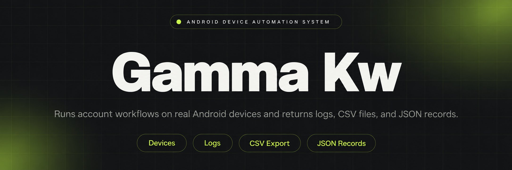
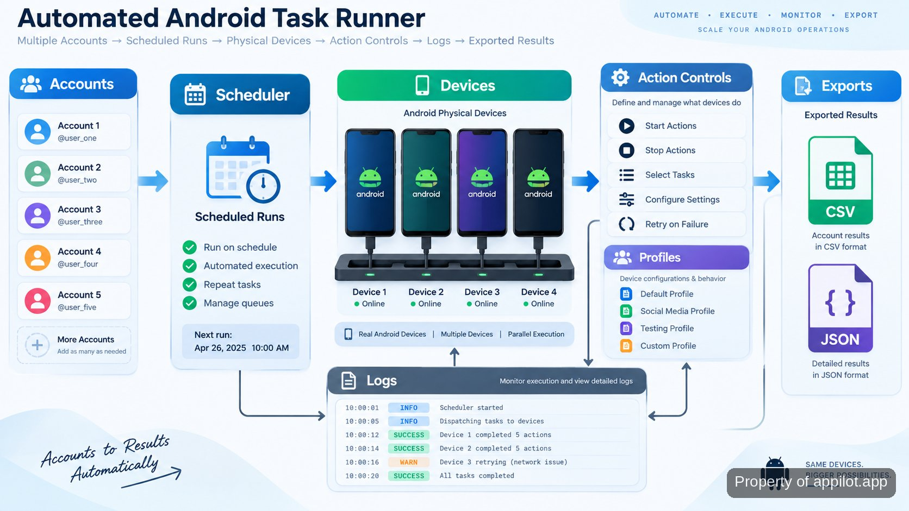

<p align="center">
  <a href="https://www.appilot.app" target="_blank" rel="nofollow">
    
  </a>
</p>

## gamma kw

gamma kw is a repository-based automation system for running account and app workflows on genuine Android hardware. The setup uses physical devices, scheduled jobs, operator controls and structured outputs instead of relying on emulator-based runs. The system is used when repeated actions across many accounts or devices become difficult to manage manually.

> Real device workflows with visible runs, controls and outputs.

The main workflow is built around controlled device activity: a task enters the scheduler, a device receives the action, logs record what happened, and exported data or run results are stored for review. The repository keeps the moving parts separated so operators can inspect configuration, execution logic and collected results without tracing a single large script.

<a href="https://www.appilot.app" target="_blank" rel="nofollow">
  
</a>

<p align="center">
  <a href="https://t.me/Bitbash333" target="_blank" rel="nofollow">
    
  </a>&nbsp;
  <a href="https://wa.me/923249868488?text=Hi%2C%20I%27m%20interested." target="_blank" rel="nofollow">
    
  </a>&nbsp;
  <a href="mailto:hello@appilot.app" target="_blank" rel="nofollow">
    
  </a>&nbsp;
  <a href="https://www.appilot.app" target="_blank" rel="nofollow">
    
  </a>
</p>



## Core Features

| Feature | Description |
| --- | --- |
| Physical Device Fleet Control | Managing many devices manually creates inconsistent runs. The system connects scheduled actions to genuine Android hardware with centralized device operations and remote management. |
| Scheduled Account Actions | Repeated account tasks become difficult when timing differs between devices. The scheduler assigns planned actions, queues work and records execution results. |
| Operator Logs and Retries | Failed runs are hard to diagnose without history. Live logs, retry handling and failure records show where an action stopped and what happened next. |
| Mobile App Data Extraction | Collecting app information manually slows research workflows. The extraction process gathers structured data from app sessions and prepares exports in usable formats. |
| Warmup Workflow Controls | New accounts require paced activity rather than sudden volume. Warmup routines apply staged actions, health checks and pause rules before additional activity. |
| Approval Gates | Sensitive account changes need human review. Operator checkpoints allow actions to be inspected before selected higher-risk steps continue. |

## Android Device Automation Architecture

The repository is organized around a device execution layer, scheduling service, storage layer and operator interface. Physical Android devices provide the runtime environment, while the control layer decides when jobs run and which device receives them. Device communication can use Android Debug Bridge, which provides command-line interaction with Android devices through the official Android platform tools documentation: <a href="https://developer.android.com/tools/adb" target="_blank" rel="nofollow">Android Debug Bridge documentation</a>.

The stack separates input handling from execution. Account lists, device assignments and task definitions are loaded before a run starts. The scheduler creates a queue, workers execute approved actions, and logging records timestamps, device states and failures. This structure removes a common failure mode in manual automation: losing track of which device performed which action.

A typical run can contain several devices, each with its own assigned profile and task sequence. The operator can review logs after an overnight run, identify failed steps and restart only the affected work instead of repeating the entire process.

## Mobile App Scraping Data Flow

Mobile app scraping focuses on collecting structured information from genuine Android sessions. The extraction path takes app session data, applies field mapping rules, normalizes records and writes the result into export files. The system does not depend on a browser emulator layer for this workflow.

The output format depends on the configured extraction job. A completed run can produce CSV or JSON datasets for later processing. For example, a scheduled collection task can capture defined fields from an app session, store the normalized records and leave an operator with a file that can be reviewed or passed into another internal process.

The extraction approach follows common data pipeline practices: collect only configured fields, keep transformations visible and preserve run history. The repository structure makes those stages easier to inspect when a field mapping needs adjustment.

## Account Warmup Automation Workflows

Account warmup automation is used for staged activity before larger operating routines begin. The workflow applies planned sequences, device and profile pairing, health checks and pause rules when a run needs review.

A warmup sequence may begin with a small set of scheduled actions, record the result, then continue according to the configured rules. The system does not promise that an account will avoid restrictions because platform decisions remain outside the tool. Instead, it provides pacing controls, logs and operator review points.

Rate limits, meaning restrictions on how frequently actions occur, are handled through controlled queues and timing rules. This keeps operators aware of activity levels and reduces accidental bursts caused by manual repetition.

<a href="https://tally.so/r/yP5oDx?platform=GitHub&amp;format=Product+repo&amp;brand=Appilot&amp;niche=appilot&amp;page=Gamma+Kw+for+Android+Devices&amp;date=2026-09-17" target="_blank" rel="nofollow">
  
</a>

## Social Media Automation Bots

Running many accounts across social channels creates repetitive tasks that are difficult to coordinate. The system supports channel actions through controlled bots, queues and human approval points for selected operations.

Operators can organize activity by account, device and campaign settings. Human review remains part of the workflow where actions require additional attention. Platform rules and account outcomes are determined by each service, so the system focuses on execution controls rather than promising a specific account result.

The design follows operational practices used in automation systems: visible logs, controlled retries and clear ownership of each run. Documentation for Android app behavior and application lifecycle concepts is available through the official Android developer resources: <a href="https://developer.android.com/topic/architecture" target="_blank" rel="nofollow">Android app architecture guidance</a>.

## Project Directory

```text
gamma-kw/
├── src/
│   ├── scheduler.py
│   ├── device_manager.py
│   ├── worker.py
│   └── logger.py
├── configs/
│   ├── devices.yaml
│   ├── tasks.yaml
│   └── profiles.yaml
├── exports/
│   ├── runs.csv
│   └── records.json
├── dashboard/
│   ├── app.js
│   └── views/
│       └── runs.html
├── requirements.txt
└── README.md
```

## Technical Stack and Runtime

The runtime is built around Python services, Android device communication and structured configuration files. Python handles scheduling, task execution and data processing because the workflow requires readable automation logic and integration between multiple system components. Configuration files keep device assignments and task definitions separate from execution code.

The dashboard layer provides operator visibility into runs, failures and statuses. JSON and CSV exports keep collected records portable. The repository can connect with standard developer tooling such as Git version control through the official Git documentation: <a href="https://git-scm.com/doc" target="_blank" rel="nofollow">Git documentation</a>.

```bash
python -m venv .venv
source .venv/bin/activate
pip install -r requirements.txt
python src/scheduler.py
```

## How to Run Using gamma kw

- **STEP 1 — Download & Set Up the Project** Download, set up, and install **gamma kw** to get the project running, and obtain the repository package from the provided project source.
- **STEP 2 — Open Dashboard** Open the operator dashboard, review connected devices, and access the available task queues before starting a workflow.
- **STEP 3 — Configure Run** Select the task mode, assign profiles, choose devices, and enter fields defined in the configuration files.
- **STEP 4 — Start Execution** Trigger the run command, then review logs and receive generated CSV or JSON exports from completed jobs.

## Use Cases

- Coordinate many account actions from physical devices instead of manually repeating the same steps on each phone.
- Collect structured app session data when manual extraction across devices becomes too slow to maintain.
- Run staged account warmup routines with pacing controls, logs and operator checkpoints.
- Review overnight automation runs through recorded events, failures and exported files.

## Operational Notes

The system is designed around visibility. Every run has a path from input configuration to device execution to stored output. This makes debugging easier because operators can inspect the exact stage where a task stopped.

A production setup benefits from clear device ownership, maintained configuration files and regular review of logs. The repository includes the pieces needed to understand the workflow, while platform-specific behavior remains controlled by the services where accounts operate.

External references for application security and automation practices include the OWASP Mobile Security Testing Guide: <a href="https://mas.owasp.org/" target="_blank" rel="nofollow">OWASP Mobile Security Testing Guide</a>, and the Android security documentation: <a href="https://source.android.com/docs/security" target="_blank" rel="nofollow">Android security overview</a>.

## FAQ

### Can this tool run automation on real Android phones instead of emulators?

Yes. The system runs workflows on genuine Android hardware. Device management, scheduling and logs are organized around physical devices rather than emulator environments.

### How does the system handle account warmup and pacing?

The workflow uses staged activity sequences, timing controls, profile pairing and pause rules. These controls help operators manage activity patterns, but account decisions remain controlled by each platform.

### What data can the mobile extraction workflow export?

The extraction workflow can produce structured CSV and JSON records based on configured fields. The process includes mapping and normalization before saving the output.

### Can operators review actions before sensitive account changes happen?

Yes. Approval gates can be used for selected higher-risk actions. Operators can inspect planned activity and logs before continuing those steps.

<table>
  <tr>
    <td align="center" width="33%">
      
      <p>This scraper helped me gather thousands of posts effortlessly. The setup was fast, and exports are super clean and well-structured.</p>
      <p><b>Nathan Pennington</b><br>Marketer<br>★★★★★</p>
    </td>
    <td align="center" width="33%">
      
      <p>What impressed me most was how accurate the extracted data is. Likes, comments, timestamps — everything aligns perfectly.</p>
      <p><b>Greg Jeffries</b><br>SEO Affiliate Expert<br>★★★★★</p>
    </td>
    <td align="center" width="33%">
      
      <p>It's by far the best tool I've used. Ideal for trend tracking, competitor monitoring, and influencer insights.</p>
      <p><b>Karan</b><br>Digital Strategist<br>★★★★★</p>
    </td>
  </tr>
</table>