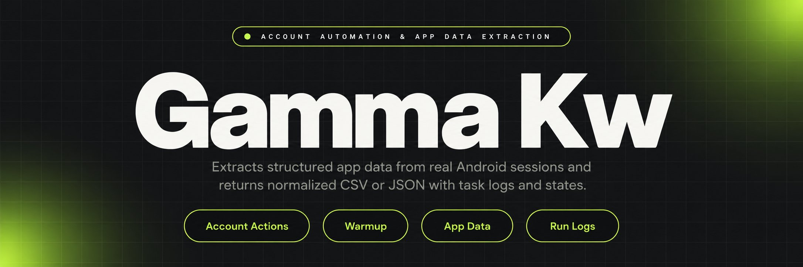
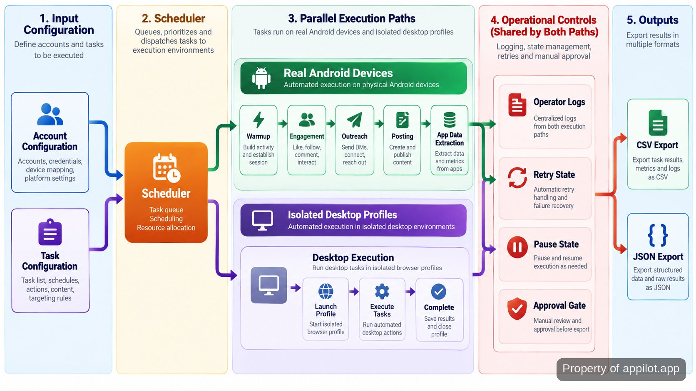

<p align="center">
  <a href="https://www.appilot.app" target="_blank" rel="nofollow">
    
  </a>
</p>

## Gamma KW

**Gamma KW** is the repository I run to schedule account actions across genuine Android devices and fingerprint-isolated desktop profiles, extract structured data from mobile apps, and keep the run visible through logs, retries, and operator controls. It is for work that becomes brittle when accounts, profiles, and devices are handled one at a time.

The tool has five practical jobs: route scheduled actions to physical phones, send desktop tasks to isolated profiles, pace outreach and engagement, stage warmup activity, and export collected app data as CSV or JSON. A centralized operator dashboard shows live logs, retries, and failure states. It does not promise that an account will avoid a ban. Pacing, health checks, approval gates, and pause rules reduce operator mistakes; the platform still decides what gets flagged.

> Real devices in, governed account work in the middle, logs and structured outputs out.

<a href="https://www.appilot.app" target="_blank" rel="nofollow">
  
</a>

<p align="center">
  <a href="https://t.me/Bitbash333" target="_blank" rel="nofollow">
    
  </a>&nbsp;
  <a href="https://wa.me/923249868488?text=Hi%2C%20I%27m%20interested." target="_blank" rel="nofollow">
    
  </a>&nbsp;
  <a href="mailto:hello@appilot.app" target="_blank" rel="nofollow">
    
  </a>&nbsp;
  <a href="https://www.appilot.app" target="_blank" rel="nofollow">
    
  </a>
</p>

## What a run does

A run starts from configuration rather than from a pile of hand-operated sessions. Account records are paired with a device or desktop profile, then assigned a task route such as warmup, engagement, outreach, posting, or data extraction. The scheduler releases work according to the pacing and queue rules in the config instead of firing every action at once.

On Android, the runner talks to connected hardware through <a href="https://developer.android.com/tools/adb" target="_blank" rel="nofollow">Android Debug Bridge</a> and drives app sessions through <a href="https://appium.io/docs/en/latest/" target="_blank" rel="nofollow">Appium</a>. Desktop work is handed to isolated browser profiles through the <a href="https://localapi-doc-en.adspower.com/" target="_blank" rel="nofollow">AdsPower Local API</a> or <a href="https://multilogin.com/help/api/" target="_blank" rel="nofollow">Multilogin API</a>, depending on the route. Each task writes a result record, a timestamped operator log, and any retry or pause reason before the queue advances.

The workflow is intentionally inspectable. When something fails, the useful question is not merely “did it stop?” but which account, device, profile, action, and retry state produced the stop. That makes overnight runs reviewable the next morning without replaying every session by hand.



## Core Features

| Feature | Description |
| --- | --- |
| Real Android device routing | Manual device switching does not scale. Tasks are assigned to genuine Android hardware, with centralized scheduling and remote operation rather than an emulator layer. |
| Desktop profile routing | Shared browser state makes multi-account work fragile. Tasks can be sent to fingerprint-isolated AdsPower or Multilogin profiles through their APIs. |
| Warmup-aware pacing | New or sensitive accounts should not jump straight to volume. Staged warmup playbooks, rate limits, queues, and pause-on-risk rules control how actions are released. |
| Approval gates | High-risk actions should not disappear into an unattended queue. Routes can require operator approval before the action is allowed to proceed. |
| Structured app extraction | Copying app data by hand creates inconsistent records. The extraction path maps fields into normalized CSV or JSON output suitable for downstream loading. |
| Logs, retries, and failure alerts | Silent failures waste devices and profiles. Each run records task state, retry attempts, failure reasons, and alert state so an operator can see what needs attention. |

These features cover the same control loop from two sides: execution and governance. The system can perform repeated account work, but it also leaves enough state behind to decide whether the next action should run, retry, pause, or wait for a person.

## Inputs and outputs

The main inputs are account records, device or profile assignments, task routes, schedules, pacing rules, approval requirements, health state, and field mappings for extraction. I keep them in <a href="https://yaml.org/spec/1.2.2/" target="_blank" rel="nofollow">YAML</a> so the run configuration stays reviewable in Git, while account payloads that need bulk editing can enter as CSV. The parser validates required fields before anything is placed on a queue.

Outputs depend on the route. Engagement, outreach, posting, and warmup tasks produce status records, campaign report rows, and logs that identify the account, target device or profile, action, and result. Extraction routes additionally write normalized datasets in <a href="https://www.rfc-editor.org/rfc/rfc4180" target="_blank" rel="nofollow">CSV</a> or <a href="https://www.rfc-editor.org/rfc/rfc8259" target="_blank" rel="nofollow">JSON</a> form. Those formats are plain enough to inspect locally and predictable enough to load into another system.

The important failure mode here is partial success. A long run can finish with most accounts completed and a smaller set paused or retried. The output keeps those states separate, so rerunning the failed work does not require pretending the whole batch failed.

<a href="https://tally.so/r/yP5oDx?platform=GitHub&amp;format=Product+repo&amp;brand=Appilot&amp;niche=appilot&amp;page=Gamma+KW+on+Real+Android+Devices&amp;date=2026-09-24" target="_blank" rel="nofollow">
  
</a>

## Tech Stack

| Layer | What it is used for |
| --- | --- |
| <a href="https://docs.python.org/3/" target="_blank" rel="nofollow">Python</a> | CLI entry points, scheduling logic, routing, validation, retries, exports, and operator logging. |
| ADB + Appium | Connection to genuine Android hardware and repeatable control of mobile app sessions. |
| AdsPower / Multilogin APIs | Creation or selection of isolated desktop profiles and routing tasks into the correct profile group. |
| YAML | Human-readable run configuration for account assignment, pacing, approvals, schedules, and extraction mappings. |
| CSV / JSON | Portable inputs and normalized data exports that can be reviewed without proprietary tooling. |

The stack is deliberately boring in the useful sense: text configuration, a CLI, stable device and profile interfaces, and outputs that open everywhere. The repository does not need an opaque control plane to explain what happened. Python’s standard logging facilities handle the local event trail, while the runbook defines what to do with repeated failures and paused accounts.

## Directory Structure

```text
gamma-kw/
├── gamma_kw/
│   ├── cli.py
│   ├── dashboard.py
│   ├── scheduler.py
│   ├── devices.py
│   ├── desktop.py
│   ├── actions.py
│   ├── warmup.py
│   ├── scraping.py
│   ├── approvals.py
│   ├── retries.py
│   ├── exports.py
│   └── logsetup.py
├── config/
│   ├── accounts.example.yaml
│   └── routes.example.yaml
├── data/
│   ├── input/
│   └── output/
├── logs/
├── scripts/
│   └── healthcheck.py
├── requirements.txt
├── README.md
└── RUNBOOK.md
```

The split mirrors the way the tool is operated. The CLI and dashboard expose the same scheduler, while device control, desktop profile control, account actions, warmup, extraction, approvals, retries, and exports stay in separate modules. Configuration and generated data remain outside the package. That separation matters during incident review: a bad field mapping can be fixed without touching pacing, and a desktop profile issue can be isolated without changing the Android path.

```bash
python -m venv .venv
source .venv/bin/activate
pip install -r requirements.txt
cp config/accounts.example.yaml config/accounts.yaml
python -m gamma_kw validate --config config/accounts.yaml
python -m gamma_kw dashboard --config config/accounts.yaml
```

## Performance Benchmarks

I do not publish a made-up throughput figure for this repository because the useful rate is set by account pacing, device availability, app behavior, approval gates, and the task itself. The benchmark that matters is whether scheduled work finishes with a clear state for every account instead of leaving an operator to guess which sessions stalled. The dashboard keeps completed, paused, retried, failed, and alert states visible while a run is active.

| Measure | What to record |
| --- | --- |
| Queue completion | Completed, paused, retried, and failed task states at the end of a run. |
| Retry quality | Whether a retry resumes the intended action or simply repeats a bad state. |
| Device health | Connected hardware, reachable app sessions, and any device taken out of rotation. |
| Profile health | Desktop profile launch success, API errors, and routes held back from further work. |
| Export integrity | Expected fields present, normalized values written, and malformed rows separated for review. |

Two architecture facts are fixed: mobile automation runs on real Android hardware, not emulators, and operations are centralized through one dashboard layer. Everything else should be measured against the workload actually being run. That keeps the page honest and makes local benchmark results comparable from one run to the next.

## Use Cases

- Run overnight warmup queues for many accounts while keeping device/profile pairing, pacing, health checks, and pause rules visible to the operator.
- Route engagement, DM, or posting tasks across accounts without opening each phone or desktop profile manually, while holding higher-risk actions behind approval gates.
- Extract structured fields from mobile app sessions on genuine Android devices and write normalized CSV or JSON files for later analysis or warehouse loading.
- Operate mixed mobile and desktop account workflows from the same runbook, using real phones for app-native work and isolated profiles where a desktop session is required.

These cases share the same practical constraint: manual work stops being reliable once there are enough accounts that context switching becomes the job. The tool replaces that switching with explicit queues and visible states, but it does not decide what a platform will permit. If an account gets flagged, the useful controls are pacing, pause rules, logs, and a human decision about what happens next.

## How to Run Account Automation Using Gamma KW

- **STEP 1 — Download & Set Up the Project** Download, set up, and install **Gamma KW** to get the project running; clone this repository, create the virtual environment, and install `requirements.txt`.
- **STEP 2 — Open the Dashboard** Activate the environment and run `python -m gamma_kw dashboard --config config/accounts.yaml`, then confirm connected devices, desktop profiles, and validation status.
- **STEP 3 — Configure the Route** Choose device or profile assignment, task type, pacing, approval requirement, schedule, health rule, and export mapping, then save the reviewed route.
- **STEP 4 — Run and Review** Start the queue from the dashboard; review completed, paused, retried, failed, and alert states, then inspect CSV or JSON exports for extraction routes.

The setup path is intentionally local and explicit. There is no hidden step between configuration and execution: validation checks the files, the scheduler routes work, the adapters control devices or profiles, and the dashboard surfaces the result. When a run behaves badly, start with the state in `logs/`, then check the account route and device/profile health before rerunning anything.

## FAQ

### Does this run on real Android devices or emulators?

It runs mobile automation on genuine Android hardware rather than emulators. The device layer uses ADB and Appium to reach the phone, start the relevant app session, and return task state to the scheduler.

### How are risky account actions controlled?

Riskier actions can be paced, queued, paused, or held behind an operator approval gate. Those controls reduce accidental bursts and make intervention possible, but they do not make an account ban-proof or guarantee compliance with a platform’s rules.

### What files does a scraping run produce?

Extraction routes produce normalized CSV or JSON datasets plus the same operator logs and task states used by other routes. Field mappings are defined in configuration so repeated runs write the same columns and value shapes.

<table>
  <tr>
    <td align="center" width="33%">
      
      <p>This scraper helped me gather thousands of posts effortlessly. The setup was fast, and exports are super clean and well-structured.</p>
      <p><b>Nathan Pennington</b><br>Marketer<br>★★★★★</p>
    </td>
    <td align="center" width="33%">
      
      <p>What impressed me most was how accurate the extracted data is. Likes, comments, timestamps — everything aligns perfectly.</p>
      <p><b>Greg Jeffries</b><br>SEO Affiliate Expert<br>★★★★★</p>
    </td>
    <td align="center" width="33%">
      
      <p>It's by far the best tool I've used. Ideal for trend tracking, competitor monitoring, and influencer insights.</p>
      <p><b>Karan</b><br>Digital Strategist<br>★★★★★</p>
    </td>
  </tr>
</table>