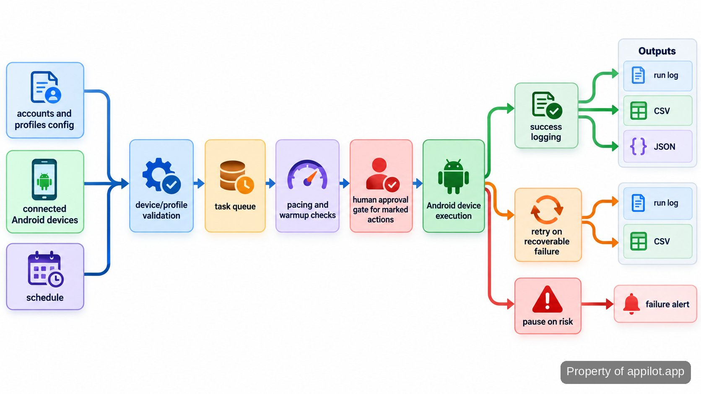

<p align="center">
  <a href="https://www.appilot.app" target="_blank" rel="nofollow">
    
  </a>
</p>

## gamma kw

**gamma kw** is the account-action runner in this repository. It sends scheduled work to real <a href="https://developer.android.com/" target="_blank" rel="nofollow">Android</a> phones, keeps device and profile assignments explicit, applies pacing before actions leave the queue, and records what happened. The practical reason to run it is simple: manual account work stops being dependable once several profiles and devices need attention at the same time. The bot turns that work into a repeatable run without pretending the platform is under its control.

The repository is meant for operators who already understand accounts, profiles, warmup, rate limits, and the impact of getting flagged. The useful parts are visible rather than hidden behind a hosted service: configuration lives beside the code, runs can be started from the command line, logs stay local, and structured output can be inspected after the devices finish. Real phones are the execution layer, not an emulator pool.

<a href="https://www.appilot.app" target="_blank" rel="nofollow">
  
</a>

<p align="center">
  <a href="https://t.me/Bitbash333" target="_blank" rel="nofollow">
    
  </a>&nbsp;
  <a href="https://wa.me/923249868488?text=Hi%2C%20I%27m%20interested." target="_blank" rel="nofollow">
    
  </a>&nbsp;
  <a href="mailto:hello@appilot.app" target="_blank" rel="nofollow">
    
  </a>&nbsp;
  <a href="https://www.appilot.app" target="_blank" rel="nofollow">
    
  </a>
</p>

## What the bot runs

A run starts from an operator-owned configuration that names devices, profiles, schedules, pacing rules, and actions. The scheduler turns that configuration into queued tasks. Before a task reaches a phone, the runner checks its profile assignment, applies the configured delay or warmup rule, and holds any action that requires approval. Approved work is sent through <a href="https://developer.android.com/tools/adb" target="_blank" rel="nofollow">Android Debug Bridge</a>, the standard Android command-line interface for communicating with connected devices.

Each attempted action returns to the same control path. Success is logged; a recoverable failure can enter the retry path; a risk condition can pause the profile instead of pushing more work at it. The point is not to claim that a platform will accept every action. The controls exist so the operator can see what ran, slow work down, stop a profile, and separate a device problem from an account problem before the next scheduled batch.

## Core Features

| Feature | Description |
| --- | --- |
| Physical-device execution | Emulator-specific behavior is removed from the run path. Actions are dispatched to genuine Android phones that can be paired with the profiles they operate. |
| Scheduled account actions | Repeated manual work is easy to miss. The scheduler queues configured outreach, engagement, posting, extraction, or warmup actions for later execution. |
| Warmup-aware pacing | Fast, uniform action bursts are an operator risk. Per-profile pacing and warmup rules control when queued work may proceed. |
| Approval gates | High-risk actions should not leave the queue by accident. Marked tasks stop for human approval before execution. |
| Retries and live run logs | A transient device or session failure should not disappear into a terminal window. Attempts, retries, and final states are logged, and failure states surface an operator alert. |
| Pause-on-risk rules | A profile that meets a configured risk condition should not keep receiving tasks. The runner can pause that profile and surface the state for review. |
| Structured exports | Manual copy-paste makes post-run checking brittle. Results can be written as CSV or JSON for inspection or downstream loading. |

The feature set is deliberately operational. It does not promise follower growth, engagement gains, invisibility, or protection from bans. Those outcomes depend on the platform and account history. What the repository controls is the mechanics around each run: which profile uses which device, how work is paced, where approval is required, what gets retried, and what evidence is left behind.

## Workflow from input to output

The run pipeline is easiest to understand as a small state machine. Configuration enters at the left. Device and profile validation happen before queue creation, so an invalid pairing fails early instead of halfway through a batch. Queued work then passes through pacing and warmup checks. Tasks marked for approval wait; the rest can move to device execution. After execution, the result is classified, logged, and either completed, retried, or paused for operator review.



That shape matters when a run fails overnight. The operator can tell whether the input was invalid, the task never cleared its gate, the phone was unreachable, or the action failed after execution. A single final “failed” status would hide those distinctions and make recovery slower.

## Technical stack

The runner is organized as a small <a href="https://docs.python.org/3/" target="_blank" rel="nofollow">Python</a> application because the workflow is mostly device I/O, queue handling, validation, and file output rather than a heavy server workload. ADB provides the device transport. Local state uses <a href="https://www.sqlite.org/docs.html" target="_blank" rel="nofollow">SQLite</a>, which keeps queues and run records in one file that is easy to inspect and back up. Human-edited settings use <a href="https://yaml.org/spec/1.2.2/" target="_blank" rel="nofollow">YAML</a>; machine outputs use standards-based <a href="https://www.rfc-editor.org/rfc/rfc8259" target="_blank" rel="nofollow">JSON</a> and CSV.

| Layer | Role in this repository |
| --- | --- |
| Python CLI | Loads configuration, validates inputs, creates runs, and exposes status commands. |
| ADB transport | Discovers connected Android hardware and sends device-level commands to the selected phone. |
| SQLite state | Stores queue state, attempts, approvals, pauses, and run history without requiring a separate database service. |
| YAML configuration | Keeps devices, profiles, schedules, pacing, and action definitions readable in version control. |
| CSV / JSON output | Writes structured results that can be reviewed directly or loaded into another data process. |

Logging follows the basic principle in the <a href="https://cheatsheetseries.owasp.org/cheatsheets/Logging_Cheat_Sheet.html" target="_blank" rel="nofollow">OWASP Logging Cheat Sheet</a>: record enough context to investigate an event without turning logs into a dump of sensitive session material. Configuration and logs should be treated as operator data, not as public repository examples.

<a href="https://tally.so/r/yP5oDx?platform=GitHub&amp;format=Product+repo&amp;brand=Appilot&amp;niche=appilot&amp;page=Gamma+Kw+on+Android+Hardware&amp;date=2026-09-26" target="_blank" rel="nofollow">
  
</a>

## Project Directory

The repository separates run configuration from device transport and from post-run output. That makes the risky parts easier to audit. A change to pacing logic does not require touching ADB code, and a new export field does not require rewriting the scheduler. The layout also keeps generated artifacts out of source modules, which is useful when a run produces logs or data overnight.

```text
device-runner/
├── config/
│   ├── devices.yaml
│   ├── profiles.yaml
│   ├── schedule.yaml
│   └── actions.yaml
├── runner/
│   ├── __main__.py
│   ├── cli.py
│   ├── config.py
│   ├── scheduler.py
│   ├── queue.py
│   ├── approvals.py
│   ├── pacing.py
│   ├── risk.py
│   ├── logging.py
│   ├── devices/
│   │   ├── adb.py
│   │   └── registry.py
│   └── exports/
│       ├── csv_writer.py
│       └── json_writer.py
├── data/
│   ├── runs.db
│   ├── exports/
│   └── logs/
├── tests/
│   ├── test_queue.py
│   ├── test_pacing.py
│   └── test_risk.py
├── requirements.txt
└── README.md
```

The `config/` directory is the operator surface. The `runner/` package owns execution rules. `data/` holds local run state and generated files. Tests focus on queue, pacing, and risk behavior because mistakes there can affect several profiles before anyone notices.

## Use Cases

- **Run account warmup on assigned phones.** Profiles can be paired with devices, paced through staged actions, and paused when a configured risk condition appears.
- **Schedule routine engagement or outreach overnight.** Instead of leaving repeated work to a manual checklist, the queue starts eligible tasks at their scheduled time and leaves a run record for review.
- **Collect structured mobile-app data.** Device sessions can produce normalized CSV or JSON output when the configured action is extraction rather than engagement.
- **Put a human gate in front of sensitive actions.** Tasks marked for approval wait until an operator explicitly clears them, while lower-risk scheduled work can continue.

These use cases share the same operating model: the bot controls sequencing and evidence, while a human still owns the policy decisions. Rate limits, warmup rules, and approval gates are safeguards around execution. They are not guarantees that an account will avoid flags or bans.

## How to Run Account Actions Using gamma kw

- **STEP 1 — Download & Set Up the Project.** Download, set up, and install **gamma kw** from this repository, then create the local Python environment and install the listed dependencies.
- **STEP 2 — Connect Devices.** Attach the Android phones, confirm ADB can see them, then map each device identifier in `config/devices.yaml`.
- **STEP 3 — Configure the Run.** Add profile assignments, schedule entries, pacing rules, approval requirements, and the permitted actions in the YAML files under `config/`.
- **STEP 4 — Run and Review.** Start the CLI run, then inspect the local run log, queue state, and any CSV or JSON files written under `data/`.

```bash
python -m venv .venv
source .venv/bin/activate
pip install -r requirements.txt
adb devices
python -m runner validate config/
python -m runner run config/
python -m runner status --latest
```

Validation should be run before the scheduler is started. It catches missing device mappings, unknown profile references, and malformed action configuration while the batch is still inert. The final status command is the fastest post-run check; deeper investigation belongs in the per-run log and the SQLite state.

## Run output and failure handling

A useful run leaves evidence that can be compared against the configuration that launched it. The local database keeps task state and attempts; the log records transitions and failure context; CSV or JSON contains any structured result produced by the configured action. <a href="https://www.rfc-editor.org/rfc/rfc4180" target="_blank" rel="nofollow">RFC 4180</a> is a useful reference for interoperable CSV output when downstream tools are strict about quoting and line handling.

Failure handling is intentionally split by type. A device transport problem can be retried without changing the account policy. A malformed configuration should fail validation before execution. A risk condition should pause the affected profile rather than being treated as a normal transient error. That separation is what makes overnight runs reviewable instead of opaque.

No runtime or throughput figure is published here because a number without a reproducible run would be misleading. For a local benchmark, use the same configuration on the same phones and keep the run logs. That makes queue delay, retries, and device failures comparable without turning one machine’s result into a universal claim.

## FAQ

### Does the bot run on emulators or physical phones?

It runs its mobile automation on physical Android phones. ADB is the device transport, and profiles are mapped to real devices in configuration rather than being placed into an emulator pool.

### How does it handle flagged accounts or failed actions?

Failures and risk conditions take different paths. Recoverable execution problems can be retried and logged, while a configured risk condition can pause the affected profile for operator review. Pacing, warmup, and approval gates reduce accidental over-execution, but they do not guarantee that a platform will not flag or ban an account.

### What files does a run produce?

A run updates local state and writes logs, with CSV or JSON used when the configured action produces structured data. The exact artifact depends on the action, but the repository keeps generated output under `data/` rather than mixing it with source code.

<table>
  <tr>
    <td align="center" width="33%">
      
      <p>This scraper helped me gather thousands of posts effortlessly. The setup was fast, and exports are super clean and well-structured.</p>
      <p><b>Nathan Pennington</b><br>Marketer<br>★★★★★</p>
    </td>
    <td align="center" width="33%">
      
      <p>What impressed me most was how accurate the extracted data is. Likes, comments, timestamps — everything aligns perfectly.</p>
      <p><b>Greg Jeffries</b><br>SEO Affiliate Expert<br>★★★★★</p>
    </td>
    <td align="center" width="33%">
      
      <p>It's by far the best tool I've used. Ideal for trend tracking, competitor monitoring, and influencer insights.</p>
      <p><b>Karan</b><br>Digital Strategist<br>★★★★★</p>
    </td>
  </tr>
</table>