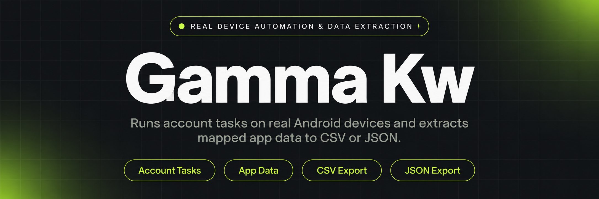
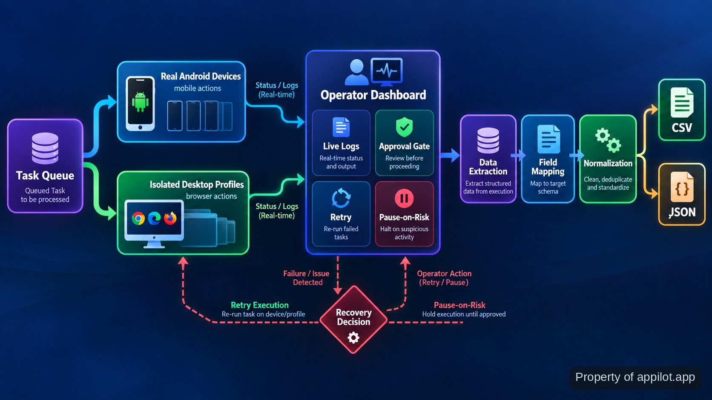

<p align="center">
  <a href="https://www.appilot.app" target="_blank" rel="nofollow">
    
  </a>
</p>

## Gamma KW

**Gamma KW** is the repository I use to schedule account work across real <a href="https://developer.android.com/" target="_blank" rel="nofollow">Android</a> devices, route desktop-profile tasks, collect app data, and keep operators in control of actions that can get accounts flagged. It is not an emulator wrapper. The mobile side runs against genuine Android hardware, while the desktop side can hand work to isolated profiles in <a href="https://www.adspower.com/" target="_blank" rel="nofollow">AdsPower</a> or <a href="https://multilogin.com/" target="_blank" rel="nofollow">Multilogin</a>. The same operator view exposes queued work, live logs, retries, pauses, and completed exports.

The practical fit is straightforward: this is for an agency or operator managing many accounts or devices at once, where manual repetition stops scaling and a bad run is more expensive than a slow one. The system favors pacing, queues, warmup-aware scheduling, approval gates, and pause-on-risk rules over raw speed. It can schedule outreach, engagement, posting, warmup, data extraction, and profile-routed desktop work, but it does not promise that a platform will never flag or ban an account.

Two output formats are built into the data path: CSV for quick inspection and handoff, and JSON for structured downstream use. For format details, the export layer follows the conventions described in <a href="https://www.rfc-editor.org/rfc/rfc4180" target="_blank" rel="nofollow">RFC 4180 for CSV</a> and <a href="https://www.rfc-editor.org/rfc/rfc8259" target="_blank" rel="nofollow">RFC 8259 for JSON</a>.

<a href="https://www.appilot.app" target="_blank" rel="nofollow">
  
</a>

<p align="center">
  <a href="https://t.me/Bitbash333" target="_blank" rel="nofollow">
    
  </a>&nbsp;
  <a href="https://wa.me/923249868488?text=Hi%2C%20I%27m%20interested." target="_blank" rel="nofollow">
    
  </a>&nbsp;
  <a href="mailto:hello@appilot.app" target="_blank" rel="nofollow">
    
  </a>&nbsp;
  <a href="https://www.appilot.app" target="_blank" rel="nofollow">
    
  </a>
</p>

## Core Features

The feature set is organized around the failure points that appear when account work moves from a handful of profiles to a fleet: inconsistent pacing, stale sessions, missed retries, unclear ownership, and exports that need manual cleanup.

| Feature | Description |
| --- | --- |
| Real Android device runs | Emulator-only behavior is not representative enough for this workflow. Scheduled mobile actions run on physical Android devices and stay visible through centralized operations. |
| Scheduled account actions | Operators should not babysit overnight queues. Outreach, engagement, posting, warmup, and other account actions can be scheduled with rate limits, queues, and warmup-aware pacing. |
| Approval gates | Some actions deserve a human decision before execution. Higher-risk account actions can wait for approval instead of moving automatically from queue to device. |
| Desktop profile routing | Profile work becomes brittle when operators open sessions by hand. Tasks can be routed into isolated desktop profiles managed through AdsPower or Multilogin. |
| Structured app-data exports | Raw app sessions are awkward to reuse. Extracted fields are mapped and normalized before export to CSV or JSON, with scheduling and failure recovery around the collection run. |
| Logs, retries, and pause rules | Silent failures create duplicate actions and hard-to-audit accounts. Runs expose live logs, retry paths, and automated pause-on-risk behavior so an operator can stop or resume work deliberately. |

## Workflow: From Queue to Export

A normal run starts with a prepared account or profile, a paired device where the mobile path is required, and a task definition that specifies the action, pacing, and any approval requirement. The scheduler places that work in a queue rather than firing every account at once. Warmup rules and rate limits shape when the task is allowed to move.

The worker then sends the task to the correct execution path: a real Android device for mobile app work, or the assigned desktop profile for browser-side work. During execution, the operator dashboard receives status and log events. A recoverable failure can return to the retry path; a risk signal can pause the task instead of continuing blindly. For log design, the repository follows the same basic principles as the <a href="https://cheatsheetseries.owasp.org/cheatsheets/Logging_Cheat_Sheet.html" target="_blank" rel="nofollow">OWASP Logging Cheat Sheet</a> and <a href="https://csrc.nist.gov/pubs/sp/800/92/final" target="_blank" rel="nofollow">NIST log management guidance</a>: record enough context to reconstruct what happened without treating logs as an afterthought.

When the run is a scraping job, mapped fields pass through normalization before the exporter writes the structured dataset. Account-action jobs finish with status and campaign reporting rather than a dataset. The important distinction is that the queue, execution path, logging, recovery, and operator decision points are visible in one flow.



## Technical Stack

The stack is deliberately operational rather than decorative. The mobile execution layer is a fleet of genuine Android phones. The desktop execution layer uses profile managers that keep browser identities separated per account. Above both sits a scheduler and worker queue, with an operator dashboard for task state, logs, approvals, and retries. The export layer handles field mapping, normalization, CSV, and JSON.

That split matters because each layer owns one job. Devices execute mobile actions; profile managers contain desktop sessions; the queue controls pacing; the dashboard exposes what is happening; exporters turn collected app data into reusable records. The repository does not depend on one opaque process doing all five things. That makes failures easier to locate: a device issue, a profile issue, a blocked approval, and a bad export are separate states rather than one generic error.

For security review of the mobile side, <a href="https://mas.owasp.org/MASVS/" target="_blank" rel="nofollow">OWASP MASVS</a> is a useful external benchmark for thinking about mobile-app handling and sensitive data boundaries. It does not certify this repository; it is simply a reference standard for evaluating mobile application security controls.

<a href="https://tally.so/r/yP5oDx?platform=GitHub&amp;format=Product+repo&amp;brand=Appilot&amp;niche=appilot&amp;page=Gamma+KW+on+Real+Android+Devices&amp;date=2026-09-24" target="_blank" rel="nofollow">
  
</a>

## Project Directory and Commands

The repository keeps runtime code, fleet configuration, task definitions, export mapping, and operator scripts separate. That separation is useful when something changes overnight: a pacing rule can be edited without touching export mappings, and a field-mapping change does not require rewriting device assignment.

```text
gamma-kw/
├── config/
│   ├── devices.yaml
│   ├── profiles.yaml
│   ├── rate-limits.yaml
│   └── warmup.yaml
├── tasks/
│   ├── nightly.yaml
│   └── scrape.yaml
├── mappings/
│   └── fields.yaml
├── src/
│   ├── scheduler/
│   ├── workers/
│   ├── dashboard/
│   ├── exports/
│   └── connectors/
├── scripts/
│   ├── bootstrap
│   ├── start
│   ├── run-once
│   ├── status
│   └── retry-failed
├── runs/
└── README.md
```

The normal local path is to bootstrap once, start the services, then either let the scheduler pick up configured work or trigger a single task file. `status` is the first check when a run stalls because it shows whether work is queued, active, paused, failed, or complete. Failed work is retried explicitly rather than by restarting the whole fleet.

```bash
./scripts/bootstrap
./scripts/start
./scripts/run-once --config tasks/nightly.yaml
./scripts/status
./scripts/retry-failed
```

## Performance, Failure Handling, and Run Hygiene

The main operating rule is to preserve account state rather than chase throughput. I do not publish a jobs-per-hour figure because there is no measured benchmark in this repository that I can support. For comparisons, use like-for-like task files and read queue duration, retries, pauses, and completion state from the run logs. A slower queue is recoverable; replaying uncertain work is not.

That is why retries and pauses are explicit parts of the run. A recoverable technical failure can re-enter the queue under the configured retry path. A risk-related condition can pause the affected account or task so an operator decides what happens next. Approval gates provide the same control before selected higher-risk actions. Warmup playbooks are staged per platform, and device/profile pairing is kept stable where long-term trust matters.

The logs are intended for reconstruction, not decoration. A useful run record answers which account or profile was targeted, which device handled it, which task was attempted, whether approval was required, whether a retry occurred, and what final state was written. There is no ban-proof claim hidden in this design. Pacing and hygiene reduce avoidable operator mistakes; the platform still decides what gets flagged.

## Use Cases

- Run warmup overnight across paired accounts and devices, with staged activity, rate limits, health checks, and pause rules instead of a spreadsheet and a row of hand-driven phones.
- Schedule outreach or engagement across many accounts while keeping higher-risk actions behind an approval gate and leaving a log trail for retries and operator review.
- Extract structured data from a mobile app session on real Android hardware, map the required fields, normalize them, and write the result as CSV or JSON for downstream work.
- Route browser-side tasks to the correct isolated profile in AdsPower or Multilogin so operators do not have to open, match, and close sessions manually.

These cases share the same operating model: queue the work, preserve per-account context, make pacing visible, and treat failure as a state to inspect rather than a reason to replay everything. The tool fits best where the risk of a wrong action per account is higher than the inconvenience of waiting for a controlled retry.

## How to Run Scheduled Account Actions Using Gamma KW

- **STEP 1 - Download & Set Up the Project** Download, set up, and install **Gamma KW** by cloning this repository and running `./scripts/bootstrap` to prepare the declared runtime dependencies.
- **STEP 2 - Start the Operator View** Run `./scripts/start`, then open the dashboard to confirm devices, profiles, queued work, live logs, approvals, and paused tasks are visible.
- **STEP 3 - Choose the Run Inputs** Select the task definition and check device or profile assignment, account pacing, warmup stage, rate limits, approval requirements, and export mapping where applicable.
- **STEP 4 - Trigger and Read the Output** Start the configured run or call `./scripts/run-once --config tasks/nightly.yaml`; review final status, retries, reporting, or the CSV and JSON files written by extraction jobs.

For day-to-day operation, the single-run command is useful before changing a scheduled task because it exposes the same queue and logging path without waiting for the next schedule. If the run pauses or fails, `./scripts/status` comes before any retry. That keeps the operator from replaying work whose final state is still unclear.

## FAQ

### Does the tool run on emulators?

No. The mobile automation path is built around genuine Android hardware rather than emulators. That is the execution environment used for scheduled mobile actions, warmup, and app data extraction.

### How are higher-risk account actions controlled?

They can be held behind approval gates before execution. Rate limits, queues, warmup-aware pacing, health checks, and pause-on-risk rules add additional control, but none of those mechanisms can guarantee that a platform will not flag or ban an account.

### What happens when a device or profile fails during a run?

The failure is recorded in the run state and logs, then handled through the configured retry or pause path instead of replaying the entire workload. Operators can inspect the affected account, device, or profile first, then retry failed work deliberately.

<table>
  <tr>
    <td align="center" width="33%">
      
      <p>This scraper helped me gather thousands of posts effortlessly. The setup was fast, and exports are super clean and well-structured.</p>
      <p><b>Nathan Pennington</b><br>Marketer<br>★★★★★</p>
    </td>
    <td align="center" width="33%">
      
      <p>What impressed me most was how accurate the extracted data is. Likes, comments, timestamps — everything aligns perfectly.</p>
      <p><b>Greg Jeffries</b><br>SEO Affiliate Expert<br>★★★★★</p>
    </td>
    <td align="center" width="33%">
      
      <p>It's by far the best tool I've used. Ideal for trend tracking, competitor monitoring, and influencer insights.</p>
      <p><b>Karan</b><br>Digital Strategist<br>★★★★★</p>
    </td>
  </tr>
</table>