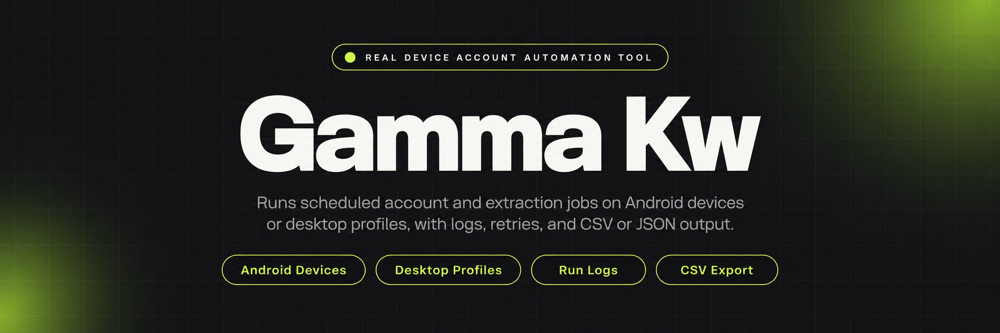
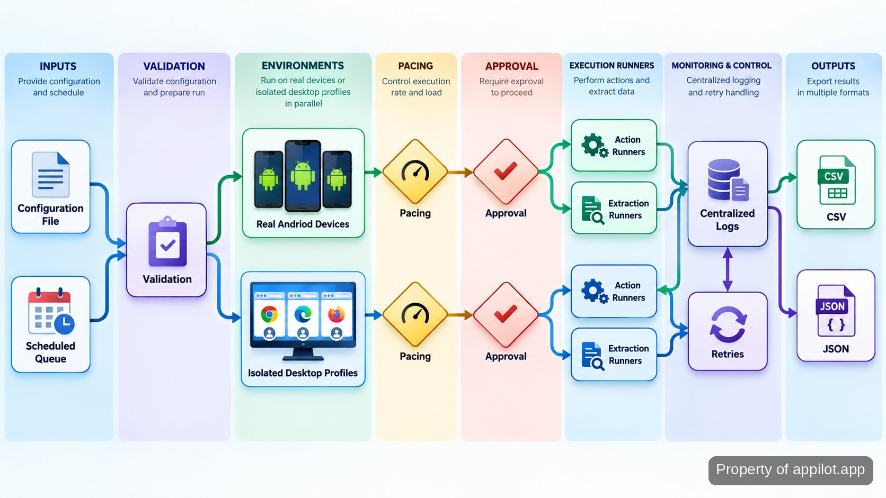

<p align="center">
  <a href="https://www.appilot.app" target="_blank" rel="nofollow">
    
  </a>
</p>

## gamma kw

gamma kw is the automation repository I use when account work has outgrown manual phones and one-off browser sessions. It routes scheduled actions to genuine <a href="https://developer.android.com/" target="_blank" rel="nofollow">Android devices</a>, keeps desktop profiles isolated, records what happened, retries recoverable failures, and writes structured app data for later review. The practical distinction is simple: mobile jobs run on physical Android hardware rather than emulators, while desktop jobs can be sent through isolated browser profiles. A profile here means a separate browser identity with its own session data and settings.

The tool is meant for operators handling many accounts or devices at once. Warmup, engagement, outreach, posting, and extraction jobs all pass through the same scheduling and logging path, with rate limits and approval gates available for higher-risk actions. It does not promise that an account will avoid a ban, and it does not decide platform policy. Its job is to make pacing, device assignment, retries, logs, and output repeatable enough that an operator can see exactly what ran and what needs attention.

<a href="https://www.appilot.app" target="_blank" rel="nofollow">
  
</a>

<p align="center">
  <a href="https://t.me/Bitbash333" target="_blank" rel="nofollow">
    
  </a>&nbsp;
  <a href="https://wa.me/923249868488?text=Hi%2C%20I%27m%20interested." target="_blank" rel="nofollow">
    
  </a>&nbsp;
  <a href="mailto:hello@appilot.app" target="_blank" rel="nofollow">
    
  </a>&nbsp;
  <a href="https://www.appilot.app" target="_blank" rel="nofollow">
    
  </a>
</p>

## Core Features

| Feature | Description |
| --- | --- |
| Real Android device runs | Manual phone work becomes the bottleneck, so scheduled jobs are assigned to physical Android devices and monitored from one operator view. |
| Desktop profile routing | Mixed browser sessions are hard to audit, so desktop tasks use isolated profiles through the configured profile manager. |
| Warmup-aware pacing | Bursting actions can get an account flagged, so queues respect per-account pacing and staged warmup rules. |
| Approval gates | High-risk actions should not fire silently, so selected actions pause for an operator decision before execution. |
| Retries and failure alerts | Transient device or session failures should not disappear. Failed work is recorded, retried where appropriate, and surfaced for review. |
| Structured extraction | Manual copying creates cleanup work, so selected app fields are normalized and exported as CSV or JSON. |

The operating model stays consistent: queue, route, apply controls, execute, then record the result. That matters more than any single bot because warmup, outreach, engagement, posting, and extraction all leave the same kind of operational trail. The operator can see which account and device were used, whether approval or a retry was required, and whether an output file was written.

## Workflow from queue to output

A run starts with a configuration file that names the task, account or profile group, pacing rules, approval requirements, and requested output. The scheduler validates that configuration, checks the target device or desktop profile, and places the work in the right queue. Mobile work is sent to a connected Android device; desktop work is sent to the configured profile manager. The action runner then executes the allowed steps, records events, and either completes, retries, pauses for approval, or marks the item for operator review.

Extraction follows the same path but ends differently. Instead of stopping at an account action, the runner captures the requested app fields, normalizes them, and writes one of two standard export shapes: CSV or JSON. Logs remain separate from the dataset so operational noise does not leak into the output. A failed item can therefore be inspected without corrupting the completed rows from the rest of the batch. In practice, that makes a mixed run easy to inspect: a warmup item can pause for review while an unrelated extraction item finishes and writes its dataset. Queue state, action logs, and exported records stay distinct, so troubleshooting one account does not require reopening every successful result.



## Tech stack and integration points

The control layer is Python because the repository needs readable job definitions, API calls, file transforms, and operator scripts in one place. Physical Android devices are discovered and checked with <a href="https://developer.android.com/tools/adb" target="_blank" rel="nofollow">Android Debug Bridge</a>. UI-level device actions use <a href="https://developer.android.com/training/testing/other-components/ui-automator" target="_blank" rel="nofollow">UI Automator</a>, which exposes visible Android interface elements without requiring the target app's source code.

Desktop profile jobs use the documented <a href="https://help.adspower.com/docs/api" target="_blank" rel="nofollow">AdsPower Local API</a> or <a href="https://multilogin.com/help/en_US/api" target="_blank" rel="nofollow">Multilogin automation API</a>, depending on the profile group in the job configuration. CSV and JSON stay as the standard extraction outputs because both are easy to inspect and pass downstream without locking the repository to a warehouse. Operational events are written as structured logs; the logging layout follows the separation principles in the <a href="https://cheatsheetseries.owasp.org/cheatsheets/Logging_Cheat_Sheet.html" target="_blank" rel="nofollow">OWASP logging guidance</a>. The scheduler and retry layer stay independent of those adapters, which makes device checks, profile checks, and output validation testable without running a full account workflow.

<a href="https://tally.so/r/yP5oDx?platform=GitHub&amp;format=Product+repo&amp;brand=Appilot&amp;niche=appilot&amp;page=Gamma+Kw+on+Real+Android+Devices&amp;date=2026-09-24" target="_blank" rel="nofollow">
  
</a>

## Project directory and local setup

The repository is split by operational responsibility rather than by social platform. Device adapters know how to reach Android hardware, profile adapters know how to reach desktop profile managers, workflow modules define warmup, engagement, outreach, posting, and extraction jobs, and governance modules hold pacing and approval rules. That layout keeps a failed integration from turning every workflow into a special case. The dashboard reads the same scheduler state rather than maintaining a second source of truth, so CLI and operator views agree about queued, paused, retried, and completed work.

```text
gamma-kw/
├── README.md
├── pyproject.toml
├── requirements.txt
├── configs/
│   ├── nightly.yaml
│   └── profiles.yaml
├── src/
│   └── gamma_kw/
│       ├── __main__.py
│       ├── cli.py
│       ├── config.py
│       ├── devices/
│       │   ├── adb.py
│       │   ├── android_runner.py
│       │   └── health.py
│       ├── profiles/
│       │   ├── adspower.py
│       │   └── multilogin.py
│       ├── workflows/
│       │   ├── warmup.py
│       │   ├── engagement.py
│       │   ├── outreach.py
│       │   ├── posting.py
│       │   └── extraction.py
│       ├── governance/
│       │   ├── approvals.py
│       │   └── limits.py
│       ├── ops/
│       │   ├── scheduler.py
│       │   ├── retries.py
│       │   └── events.py
│       ├── outputs/
│       │   ├── csv_writer.py
│       │   └── json_writer.py
│       └── dashboard/
│           └── app.py
└── tests/
    ├── test_scheduler.py
    ├── test_limits.py
    └── test_outputs.py
```

A clean machine only needs Python, the Android platform tools for mobile runs, and valid credentials for whichever desktop profile manager is enabled. The first local check should confirm that devices are visible before any account job is queued. The handoff also includes runbooks and hygiene rules for routine operation. The original post-launch support and monitoring window is 30 days; after that, the repository still carries the procedures needed for normal device checks, retry review, and output validation.

```bash
python -m venv .venv
source .venv/bin/activate
pip install -r requirements.txt
adb devices
python -m gamma_kw doctor
python -m gamma_kw run --config configs/nightly.yaml
```

## How to Run Account Automation Using gamma kw

The shortest safe path is to validate connectivity before loading account work. Keep the first run small enough to inspect every state change, then use the same configuration shape for scheduled batches once devices, profiles, controls, logs, and exports all agree.

- **STEP 1 - Download & Set Up the Project**: Download, set up, and install **gamma kw** to get the project running, then install its Python dependencies and Android platform tools on the operator machine.
- **STEP 2 - Check Devices and Profiles**: Run `python -m gamma_kw doctor` to verify connected Android devices and confirm the configured desktop profile manager can be reached.
- **STEP 3 - Configure the Queue**: Edit `configs/nightly.yaml` with the workflow, account or profile group, pacing rules, approval requirement, and CSV or JSON output mode.
- **STEP 4 - Run and Review**: Start `python -m gamma_kw run --config configs/nightly.yaml`; review logs and retries, then inspect the completed CSV or JSON export.

## Use Cases

- **Overnight account warmup:** stage lower-volume actions by account and device, keep pacing rules with the queue, and pause work automatically when the configured risk rule says the account needs review.
- **Scheduled engagement or outreach:** put repeatable account actions into queues instead of handing operators a checklist, while keeping rate limits and approval gates visible before execution.
- **Mobile app data extraction:** collect selected fields from genuine Android app sessions and deliver normalized CSV or JSON rather than copying values from screens into a spreadsheet.
- **Desktop profile operations:** route browser tasks to isolated AdsPower or Multilogin profiles so cookies, local storage, and session state are not mixed across accounts.
- **Operator recovery after failures:** use centralized logs and retry records to separate a temporary device or session problem from work that needs a manual decision.

The useful boundary is that the repository coordinates work that is already defined. It is not a general-purpose decision engine, and it does not invent outreach copy, platform policy, or account strategy. That keeps the operator in control of what the queue is allowed to do.

## Performance checks and failure handling

I do not use a single headline runtime as the benchmark because the duration of a batch depends on pacing, approvals, device state, profile availability, and the target app. The useful checks are operational: did the queue drain as expected, did retries settle, did devices remain healthy, and did every completed extraction produce a valid file? A fast run that leaves half the items in an unknown state is worse than a slower run with a complete audit trail.

The failure path is explicit. Recoverable device or session errors are retried; approval-gated work pauses; persistent failures remain visible for operator review instead of being silently discarded. Logs should also avoid secrets and session tokens, which is why the repository keeps event fields narrow and output data separate. For external context on real-device automation, the <a href="https://saucelabs.com/resources/report/sauce-labs-continuous-testing-benchmark-report" target="_blank" rel="nofollow">Continuous Testing Benchmark Report</a> and <a href="https://saucelabs.com/resources/report/the-state-of-mobile-app-quality-2026" target="_blank" rel="nofollow">State of Mobile App Quality 2026</a> are useful comparison material, not promises about this repository.

## FAQ

### Does this tool guarantee that accounts will not get banned?

No. The repository gives operators pacing rules, warmup stages, rate limits, device or profile pairing, approval gates, and pause-on-risk controls, but the platform still decides whether an account is flagged or banned. Treat those controls as governance and hygiene, not as a guarantee of an outcome outside the tool.

### What data can I export from a run?

Extraction jobs write structured CSV or JSON. The field set comes from the mapping configured for that workflow, and normalization happens before the export is written. Operational logs remain separate so retry messages and device events do not become rows in the dataset.

### Can the same repository run Android devices and desktop profiles?

Yes. Mobile jobs are routed to genuine Android hardware, while desktop jobs can be routed through AdsPower or Multilogin profiles. The scheduler and logging path are shared, but the device and profile adapters stay separate so a problem in one integration does not change the other run path.

<table>
  <tr>
    <td align="center" width="33%">
      
      <p>This scraper helped me gather thousands of posts effortlessly. The setup was fast, and exports are super clean and well-structured.</p>
      <p><b>Nathan Pennington</b><br>Marketer<br>★★★★★</p>
    </td>
    <td align="center" width="33%">
      
      <p>What impressed me most was how accurate the extracted data is. Likes, comments, timestamps — everything aligns perfectly.</p>
      <p><b>Greg Jeffries</b><br>SEO Affiliate Expert<br>★★★★★</p>
    </td>
    <td align="center" width="33%">
      
      <p>It's by far the best tool I've used. Ideal for trend tracking, competitor monitoring, and influencer insights.</p>
      <p><b>Karan</b><br>Digital Strategist<br>★★★★★</p>
    </td>
  </tr>
</table>