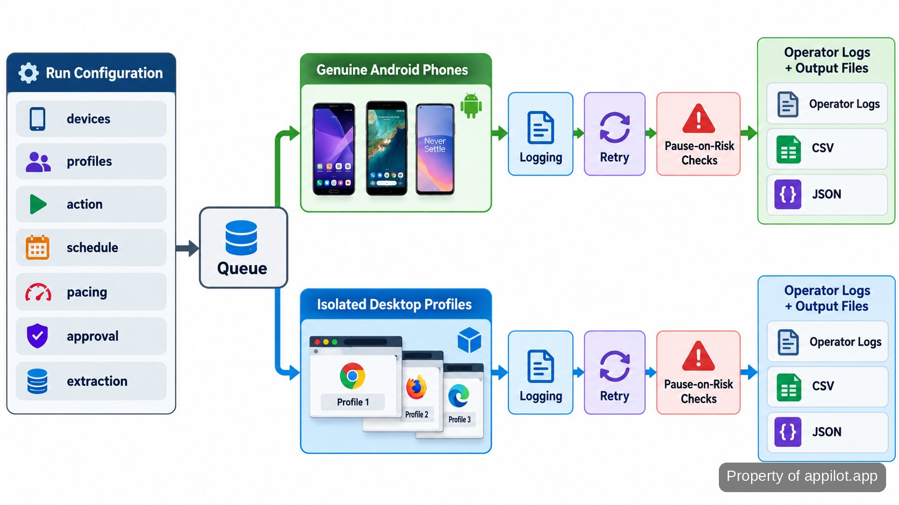

<p align="center">
  <a href="https://www.appilot.app" target="_blank" rel="nofollow">
    
  </a>
</p>

## gamma kw

`gamma kw` is the repository I run when account work has to move from a manual checklist onto real Android phones. It takes a run definition, assigns work to devices or isolated desktop profiles, applies pacing and approval rules, records what happened, retries recoverable failures, and writes structured output when extraction is part of the job. The useful boundary is simple: the tool controls the work I can control, while the platform still decides whether an account is flagged, restricted, or banned.

The system is aimed at operators handling many accounts or devices at once. Mobile actions stay on genuine Android hardware rather than emulators. Desktop work can be routed through isolated profiles managed by AdsPower or Multilogin. A scheduled run can cover outreach, engagement, posting, warmup, or data extraction, but those actions still follow the configured queue, rate limits, account state, and any approval gate. For extraction jobs, normalized records are written as CSV or JSON instead of leaving the result buried in device screens or raw session logs.

<a href="https://www.appilot.app" target="_blank" rel="nofollow">
  
</a>

<p align="center">
  <a href="https://t.me/Bitbash333" target="_blank" rel="nofollow">
    
  </a>&nbsp;
  <a href="https://wa.me/923249868488?text=Hi%2C%20I%27m%20interested." target="_blank" rel="nofollow">
    
  </a>&nbsp;
  <a href="mailto:hello@appilot.app" target="_blank" rel="nofollow">
    
  </a>&nbsp;
  <a href="https://www.appilot.app" target="_blank" rel="nofollow">
    
  </a>
</p>

## Core Features

| Feature | Description |
| --- | --- |
| Real-device execution | Manual phone work becomes a repeatable queue without replacing the phones with emulators. Tasks are assigned to connected Android devices and executed against the app session already present on each device. |
| Central scheduling | Overnight and recurring work stops depending on someone opening every account by hand. Schedules feed the queue, while one dashboard keeps device and profile assignments tied to the intended account context. |
| Retries and live logs | A dropped device or failed action does not have to vanish silently. The run records failures, retries recoverable work, and leaves an operator-readable log for anything that still needs attention. |
| Desktop profile routing | Switching between browser identities by hand is error-prone. Desktop tasks can use isolated profiles through AdsPower or Multilogin, with group-based routing and session hygiene kept separate from mobile device execution. |
| Structured extraction | Copying app data into spreadsheets creates avoidable cleanup. Extraction runs map requested fields, normalize the records, and export the result in two structured formats: CSV and JSON. |
| Pacing and approval controls | High-volume actions become risky when every account behaves the same way. Queues, rate limits, warmup-aware pacing, and approval gates keep sensitive actions under operator control. |
| Warmup risk handling | Accounts should not be pushed into production work just because a schedule exists. Staged warmup playbooks, device-profile pairing, health checks, and pause-on-risk rules can stop a questionable account before the next queued action. |

## How a Run Moves from Input to Output

A run starts with configuration, not a pile of clicks. The input names the target devices or desktop profile group, the account action, the schedule, pacing rules, whether approval is required, and any extraction fields. Android connectivity uses the official Android Debug Bridge tooling, documented in <a href="https://developer.android.com/tools/adb?authuser=1&amp;utm_source=chatgpt.com" target="_blank" rel="nofollow">Android Debug Bridge documentation</a>. Desktop profile runs use the documented APIs for <a href="https://help.adspower.com/docs/api?utm_source=chatgpt.com" target="_blank" rel="nofollow">AdsPower Local API</a> or <a href="https://multilogin.com/help/en_US/api?utm_source=chatgpt.com" target="_blank" rel="nofollow">Multilogin automation</a> when that path is selected.

- Load the run configuration and resolve the accounts, devices, profiles, action type, schedule, pacing, and approval state.
- Check that each required device or desktop profile is reachable before the task is released from the queue.
- Execute the account action or extraction step, recording success, recoverable failure, or a state that requires an operator decision.
- Retry eligible failures, pause risky accounts when configured, then write the final log and any CSV or JSON dataset produced by the run.



## Tech Stack and Runtime Boundaries

The repository is a Python command-line project because the work is mostly queue handling, API calls, device commands, validation, logging, and file output. Python's standard logging model is documented in <a href="https://docs.python.org/3/library/logging.html?utm_source=chatgpt.com" target="_blank" rel="nofollow">the logging library reference</a>. CSV and JSON remain plain interchange formats, which keeps extracted data easy to inspect and hand off without requiring a separate database service.

| Layer | What it does here |
| --- | --- |
| Python CLI | Loads configuration, validates required fields, dispatches tasks, applies retry rules, and writes run summaries. |
| Android Platform Tools | Uses `adb` to discover and address physical Android devices. The hardware-device setup path is covered by <a href="https://developer.android.com/studio/run/device?utm_source=chatgpt.com" target="_blank" rel="nofollow">Android's device guide</a>. |
| Desktop profile APIs | Starts, stops, queries, and routes isolated browser profiles through the profile manager selected in configuration. |
| Scheduler and queue | Turns a schedule into ordered account work so actions are paced instead of launched as one uncontrolled burst. |
| CSV/JSON writers | Serializes normalized extraction records using <a href="https://docs.python.org/3/library/csv.html?utm_source=chatgpt.com" target="_blank" rel="nofollow">Python CSV support</a> and <a href="https://docs.python.org/3/library/json.html?utm_source=chatgpt.com" target="_blank" rel="nofollow">Python JSON support</a> so files can be reviewed, transformed, or loaded elsewhere. |

<a href="https://tally.so/r/yP5oDx?platform=GitHub&amp;format=Product+repo&amp;brand=Appilot&amp;niche=appilot&amp;page=Gamma+KW+on+Real+Android+Devices&amp;date=2026-09-26" target="_blank" rel="nofollow">
  
</a>

## Project Directory

The layout keeps device control, desktop profile control, scheduling, policies, extraction, and outputs separate. That matters when a run fails: a connection problem should be traceable to the device adapter, while a field-mapping problem should stay in extraction code. Configuration lives outside the runtime modules so account groups, schedules, pacing, and approval settings can change without editing the dispatcher.

```text
./
├── README.md
├── pyproject.toml
├── config/
│   ├── run.example.json
│   └── policies.example.json
├── src/
│   ├── cli.py
│   ├── scheduler.py
│   ├── queue.py
│   ├── devices/
│   │   ├── adb.py
│   │   └── health.py
│   ├── profiles/
│   │   ├── adspower.py
│   │   └── multilogin.py
│   ├── actions/
│   │   ├── engagement.py
│   │   ├── outreach.py
│   │   ├── posting.py
│   │   └── warmup.py
│   ├── extract/
│   │   ├── fields.py
│   │   ├── normalize.py
│   │   └── writers.py
│   ├── policy/
│   │   ├── pacing.py
│   │   ├── approval.py
│   │   └── risk.py
│   └── logging_setup.py
├── runs/
│   └── .gitkeep
└── output/
    └── .gitkeep
```

## How to Run Account Automation Using gamma kw

- **STEP 1 - Download & Set Up the Project** Download, set up, and install **gamma kw** from this repository, install its Python dependencies, and make sure the required Android or desktop profile tooling is available locally.
- **STEP 2 - Check the Runtime** Run `python -m src.cli check` to confirm configured Android devices or desktop profiles are reachable before any queued account action starts.
- **STEP 3 - Configure the Run** Edit the run file with `devices`, `profiles`, `action`, `schedule`, `rate_limit`, `approval_required`, `fields`, and `output_format` values that match the job.
- **STEP 4 - Start and Read the Output** Run `python -m src.cli run --config config/run.json`; inspect the run log, then open the generated CSV or JSON file when extraction is enabled.

```bash
python -m src.cli check
python -m src.cli run --config config/run.json
```

## Use Cases

- Run scheduled outreach or engagement across a set of accounts without keeping an operator at each phone. The queue controls when each account receives its next action, and logs show what completed or failed.
- Warm up accounts in stages before moving them into heavier campaign work. Device-profile pairing and pause-on-risk rules keep the transition governed instead of treating every account as ready on day one.
- Extract structured data from a mobile app on genuine Android hardware. Field mapping and normalization turn what was collected into CSV or JSON records rather than a manual copy-and-paste pass.
- Route desktop work through isolated browser profiles when a task belongs in AdsPower or Multilogin rather than on a phone. Profile-group routing keeps the correct account context attached to each queued job.

## Outputs, Logs, and Recovery

Every run should leave enough evidence to answer three questions: what was queued, what actually happened, and what still needs an operator. The log is therefore part of the output, not debugging debris. Python logging provides a standard way to record events and severity levels, while the run summary ties those events back to the account, device or profile, action, and final state.

Extraction adds a second output path. Normalized records are written as CSV or JSON, matching the two formats defined for the system. A failed field mapping should not be confused with a device disconnect, so the extractor records its own validation errors before the writer creates a file. Retries apply only to failures the run treats as recoverable; approval-required or risk-paused actions remain visible for a human decision instead of being forced through automatically.

> A successful run is not just “the script finished.” It is a queue with accounted-for work, readable failures, and outputs that can be checked without replaying the session.

## What I Check Before Trusting a Run

I do not use a generic speed claim for this repository because the useful number depends on the action, the app, device availability, profile state, configured pacing, and how many retries were needed. The run evidence I care about is local and inspectable: queued versus completed actions, retry count, disconnected devices, profiles that failed to start, accounts paused by policy, and the number of records written by extraction jobs.

Before leaving scheduled work overnight, I run the connectivity check, verify the intended account-to-device or account-to-profile mapping, review pacing and approval settings, and test the output path on the same configuration shape. A run is ready when those checks pass and the log names the same targets I expect. That method catches the expensive class of mistakes early: the automation working exactly as configured, but against the wrong profile, wrong phone, wrong field map, or wrong queue.

## FAQ

### Does the tool run on emulators?

No. Mobile execution is designed around genuine Android hardware. Device communication is handled through Android tooling, while desktop-only work uses isolated browser profiles separately; the repository does not present an emulator mode as an alternative.

### Can it guarantee that accounts will not be banned?

No. The tool can enforce pacing, queues, warmup stages, approval gates, device-profile pairing, health checks, and pause-on-risk rules, but it cannot decide how a platform evaluates an account. Those controls reduce operator error and make risky states visible; they are not a ban-proof promise.

### What does a mobile app extraction run output?

An extraction run produces normalized structured records in CSV or JSON, along with the run log that records execution and failures. The configured field map determines which app data is collected and how those fields are normalized before the writer creates the output file.

<table>
  <tr>
    <td align="center" width="33%">
      
      <p>This scraper helped me gather thousands of posts effortlessly. The setup was fast, and exports are super clean and well-structured.</p>
      <p><b>Nathan Pennington</b><br>Marketer<br>★★★★★</p>
    </td>
    <td align="center" width="33%">
      
      <p>What impressed me most was how accurate the extracted data is. Likes, comments, timestamps — everything aligns perfectly.</p>
      <p><b>Greg Jeffries</b><br>SEO Affiliate Expert<br>★★★★★</p>
    </td>
    <td align="center" width="33%">
      
      <p>It's by far the best tool I've used. Ideal for trend tracking, competitor monitoring, and influencer insights.</p>
      <p><b>Karan</b><br>Digital Strategist<br>★★★★★</p>
    </td>
  </tr>
</table>