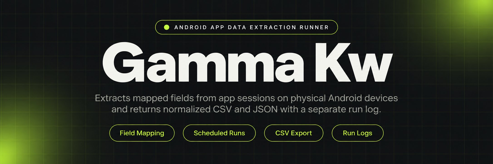
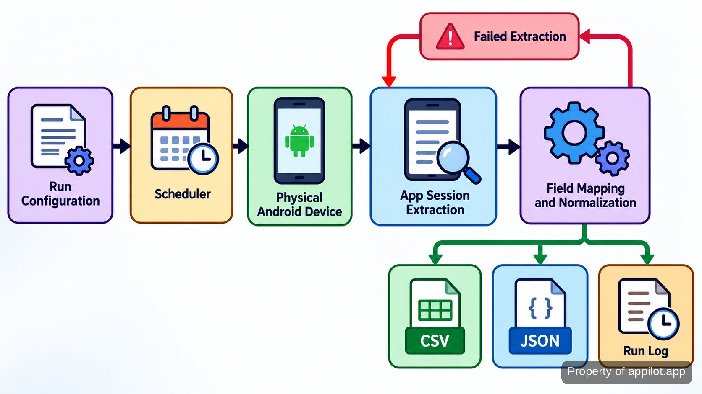

<p align="center">
  <a href="https://www.appilot.app" target="_blank" rel="nofollow">
    
  </a>
</p>

## gamma kw

`gamma kw` is the repository I use to schedule structured mobile-app data extraction on physical <a href="https://developer.android.com/docs" target="_blank" rel="nofollow">Android devices</a>. A run starts from a local configuration, assigns work to an available device, opens the required app session, captures the mapped fields, normalizes the values, and writes structured output. The practical point is simple: repeated collection work can run from the same project instead of being rebuilt by hand for every device or session.

The tool is meant for operators who already understand accounts, devices, and the cost of a bad run. It does not promise that an app will never flag activity, and it does not pretend a retry can fix every failure. Its controls are narrower and more useful: scheduled execution, physical-device sessions, explicit field mapping, run logs, retry handling, and exports that can be inspected after the job finishes.

<a href="https://www.appilot.app" target="_blank" rel="nofollow">
  
</a>

<p align="center">
  <a href="https://t.me/Bitbash333" target="_blank" rel="nofollow">
    
  </a>&nbsp;
  <a href="https://wa.me/923249868488?text=Hi%2C%20I%27m%20interested." target="_blank" rel="nofollow">
    
  </a>&nbsp;
  <a href="mailto:hello@appilot.app" target="_blank" rel="nofollow">
    
  </a>&nbsp;
  <a href="https://www.appilot.app" target="_blank" rel="nofollow">
    
  </a>
</p>

## The run from input to output

Each run follows one visible pipeline. The input is a run configuration that identifies the target app session, the fields to collect, the schedule, and the output location. The scheduler places that work on a physical Android device, the session step performs the configured collection, and the mapping layer turns captured values into the expected field names and types. If a recoverable step fails, the retry path records the failure and attempts the configured recovery instead of silently dropping the job.

Successful records then pass through normalization before export. Normalization matters because the same value can arrive with inconsistent spacing, labels, or formatting across sessions. The final stage writes the structured dataset and a run log. I use the log to separate three questions that are easy to blur together: did the device start the job, did the app session return the expected fields, and did the export finish cleanly? That separation makes troubleshooting much faster than treating a failed run as one opaque event.



## Core Features

| Feature | Description |
| --- | --- |
| Physical Android sessions | Emulator-only behavior can differ from the devices actually used in production. This runner places collection work on genuine Android hardware and keeps the device as part of the run record. |
| Scheduled extraction | Manual repetition does not scale across recurring collection jobs. The scheduler accepts the configured run and starts it without requiring an operator to repeat the same app steps by hand. |
| Field mapping and normalization | Raw values are hard to use when labels and formats drift between sessions. The mapping layer assigns expected field names and normalizes captured values before export. |
| Retry-aware failure handling | Transient device or session failures should not erase the rest of a batch. Recoverable failures are logged and routed through retries so the operator can distinguish recovered work from hard failures. |
| Structured exports | Copying results out of logs creates another manual task. Completed records are written as CSV and JSON, two common interchange formats described by <a href="https://www.rfc-editor.org/rfc/rfc4180" target="_blank" rel="nofollow">RFC 4180</a> and <a href="https://www.rfc-editor.org/rfc/rfc8259" target="_blank" rel="nofollow">RFC 8259</a>. |
| Operator run logs | A finished file is not enough when a session partly fails. Run logs expose the execution path, retries, and final state so a bad record can be traced back to the stage that produced it. |

## Inputs, schedules, and run controls

The repository keeps run behavior in configuration rather than burying it inside the extraction code. A typical configuration names the target app workflow, the devices available for the job, the fields expected from the session, the schedule, and the export destination. That makes recurring work explicit: the same collection can run again without an operator rebuilding the sequence, while a changed field map or schedule can be reviewed before the next session starts.

Before a scheduled job starts, the configuration is validated locally. Missing field mappings, an unknown device, or an invalid export path should stop before the first phone is touched. That is the cheapest place to fail. The device layer then works through Android tooling rather than an emulator abstraction; the <a href="https://developer.android.com/tools/adb" target="_blank" rel="nofollow">ADB documentation</a> explains the command bridge used to inspect and control connected Android hardware.

```bash
python -m src.cli validate config/run.yaml
python -m src.cli run config/run.yaml
```

<a href="https://tally.so/r/yP5oDx?platform=GitHub&amp;format=Product+repo&amp;brand=Appilot&amp;niche=appilot&amp;page=Gamma+Kw+on+Android&amp;date=2026-09-26" target="_blank" rel="nofollow">
  
</a>

## How to run scheduled extraction using gamma kw

- **STEP 1 - Download & Set Up the Project** Download, set up, and install **gamma kw** to get the project running; copy the repository onto the machine that will run it and install its local dependencies.
- **STEP 2 - Validate the run** Open the CLI and validate `config/run.yaml` so selected devices, field mappings, schedules, and export paths are checked before hardware is touched.
- **STEP 3 - Review the collection settings** Confirm the target app workflow, selected physical devices, mapped fields, and output directory match the run you intend to execute.
- **STEP 4 - Start and inspect** Run the configured job, then inspect the CSV or JSON dataset together with the run log to identify completed, retried, and failed work.

## Technical stack and repository layout

The stack is deliberately local and inspectable. <a href="https://docs.python.org/3/" target="_blank" rel="nofollow">Python</a> is the CLI and scheduling layer because the repository is driven by commands, configuration parsing, file handling, and retry logic rather than a browser-only interface. Android device control is kept behind the device module so collection logic does not have to know the transport details. Structured results are emitted as CSV and JSON instead of a proprietary container, which keeps downstream use simple.

State that belongs to a run, such as whether a task was queued, retried, completed, or failed, is stored separately from exported records. That separation keeps the dataset clean and lets the log remain an operational artifact rather than another data source. Configuration is also separate from extraction code, so a field mapping or schedule change does not require editing the session implementation. Log output stays focused on run state and failure evidence rather than dumping every internal event by default.

```text
app-extraction-runner/
├── config/
│   ├── run.yaml
│   ├── fields.yaml
│   └── devices.yaml
├── src/
│   ├── cli.py
│   ├── scheduler.py
│   ├── devices.py
│   ├── session.py
│   ├── mapping.py
│   ├── retry.py
│   ├── exporters.py
│   └── logging_setup.py
├── output/
│   ├── records.csv
│   ├── records.json
│   └── run.log
├── requirements.txt
└── README.md
```

## Outputs, retries, and failure evidence

A successful extraction produces structured records plus evidence about the run that produced them. CSV is convenient for spreadsheets and quick inspection; JSON preserves nested values more naturally when a downstream script needs them. The exporter should not treat those files as proof that every session succeeded. The run log is the source for operational state, including which work completed normally, which work recovered after a retry, and which work stopped with a hard failure.

That distinction becomes important overnight. A partial device outage can leave a valid file containing fewer records than expected, and the absence of an exception at the export stage does not prove the collection stage was complete. The runner therefore records failure where it happens, then carries that status to the end of the job. Downstream code should treat the dataset and the run log as separate artifacts: one contains captured values, while the other explains whether the collection path completed cleanly.

```text
run=nightly device=phone-alpha status=completed records=written
run=nightly device=phone-beta status=retried stage=session
run=nightly device=phone-gamma status=failed stage=extraction
```

## Performance checks that matter

This README does not publish a run-time, throughput, success-rate, or uptime figure because I do not have a measured value that applies across the devices and app workflow here. The useful benchmarks are measured on the hardware and extraction path actually being run: job duration, records written, retries per run, hard failures, and time spent acquiring a device versus working inside the app. Android's <a href="https://developer.android.com/topic/performance/vitals" target="_blank" rel="nofollow">performance vitals</a> and <a href="https://developer.android.com/topic/performance/benchmarking/benchmarking-overview" target="_blank" rel="nofollow">benchmarking guidance</a> are useful references for keeping device-side measurements disciplined.

For my own acceptance checks, the first question is completeness rather than raw speed. A faster run that silently skips mapped fields is worse than a slower run with a clean dataset and a traceable failure record. The next check is repeatability: the same configuration should produce the same field shape even when the values change. Finally, retry behavior should be visible in the log, not hidden inside a success count. Those checks can be measured without pretending the repository guarantees a platform outcome.

## Use Cases

- Run recurring mobile-app extraction overnight on physical Android devices, then hand the resulting CSV to an analyst who needs rows rather than screenshots or copied text.
- Collect the same mapped fields across repeated app sessions and normalize them into a stable JSON shape for another local script or warehouse-loading step.
- Separate transient device trouble from extraction failures by reviewing retries and final states in the run log before deciding which sessions need another pass.
- Change a schedule, device selection, or field map in configuration while keeping the extraction code unchanged, which is useful when the data requirement moves more often than the app flow.

## FAQ

### Does it require physical Android devices?

Yes. The run path described here is built around genuine Android hardware rather than an emulator. Device assignment and session execution assume connected or remotely managed physical phones, so an emulator-only setup would not match this repository's operating model.

### What happens when a device or extraction step fails?

Recoverable failures are recorded and sent through the configured retry path; hard failures remain visible in the run log with the stage that stopped. A retry is not treated as proof of success, so the final state still needs to be checked before the output is accepted as complete.

### What data formats does a run produce?

The extraction output is written as CSV and JSON, with operational details kept in a separate run log. CSV is useful for row-oriented inspection, while JSON is better when the captured structure needs to remain nested for downstream code.

<table>
  <tr>
    <td align="center" width="33%">
      
      <p>This scraper helped me gather thousands of posts effortlessly. The setup was fast, and exports are super clean and well-structured.</p>
      <p><b>Nathan Pennington</b><br>Marketer<br>★★★★★</p>
    </td>
    <td align="center" width="33%">
      
      <p>What impressed me most was how accurate the extracted data is. Likes, comments, timestamps — everything aligns perfectly.</p>
      <p><b>Greg Jeffries</b><br>SEO Affiliate Expert<br>★★★★★</p>
    </td>
    <td align="center" width="33%">
      
      <p>It's by far the best tool I've used. Ideal for trend tracking, competitor monitoring, and influencer insights.</p>
      <p><b>Karan</b><br>Digital Strategist<br>★★★★★</p>
    </td>
  </tr>
</table>